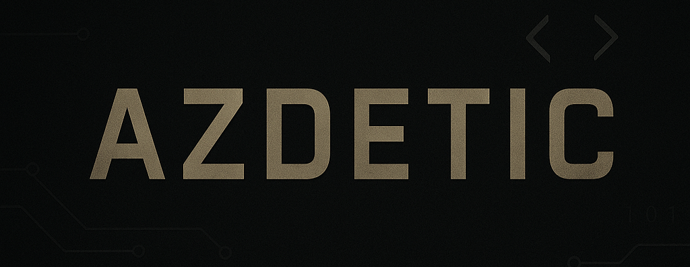

  

# Hi there, I'm Wira! 

### Student at Telkom University

 

### 🌐 Connect with me:

##  Tech Stack

**Languages**  

**Frameworks & Libraries**  

**Data Science**  

**Tools & Platforms**  

##  GitHub Stats

    
    

##  Recently Played on Spotify

  

##  Contribution Graph

  
<picture>
  <source media="(prefers-color-scheme: dark)" srcset="https://raw.githubusercontent.com/azdetic/azdetic/output/pacman-contribution-graph-dark.svg">
  <source media="(prefers-color-scheme: light)" srcset="https://raw.githubusercontent.com/azdetic/azdetic/output/pacman-contribution-graph.svg">
  
</picture>

✨ **Thanks for visiting!** ✨

